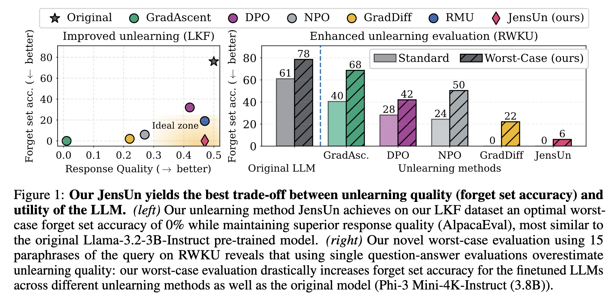

## JensUn unlearning and the LKF dataset

This repository contains code associated with our paper "Unlearning That Lasts: Utility-Preserving, Robust, and almost Irreversible Forgetting in LLMs" 
<div align="center">
    


</div>

---------------------------------------------

**Package requirements**
    The necessary Python packages should be installed. </br>
    If not already done, execute the following command:
    
```
    conda env create -f environment.yml
    conda activate lkfjensun
    pip install flash-attn==2.7.4.post1
```

---------------------------------------------

### LKF dataset

All associated subsets of Lesser Known Facts (LKF) dataset can be found in the following [HF-hub collection](https://huggingface.co/collections/nmndeep/lkf-unlearning-686e5e282802260ab336b7ec)

- For forget LKF has: Forget-Standard, Forget-train-paraphrases, Forget-eval-paraphrases
- For retain LKF has: Retain-Standard, Retain-Train-paraphrases, Retain-eval-paraphrases
- Subset used for Relearning experiments.
- The prompts, paraphrase-generation scripts can be found in [LKF_creation](LKF_creation)

---------------------------------------------

### Experiments

---------------------------------------------
#### Fine-tuning for Unlearning

- To unlearn with JensUn on LKF and evaluate on all tasks from our work:

```bash
    bash scripts/lkf_unlearn.sh
```

- To unlearn with methods other than JensUn, see available methods at the bottom of [trainer/__init__.py](src/trainer/__init__.py), then replace the first argument in `runningargs` in `scripts/lkf_unlearn.sh`.

- To unlearn without paraphrases: use `unlearn/lkf/default.yaml` in the second argument in `runningargs` in `scripts/lkf_unlearn.sh`.

- Available Unlearning methods (see [here](configs/trainer)):
    - Preference optimization: DPO, NPO, SimNPO
    - Others: GradAscent, GradDiff, RMU, JensUn (multiple variants)

- LLM can be changed here: [scripts/lkf_unlearn.sh](scripts/lkf_unlearn.sh), see [here](configs/model) for available ones

  ---------------------------------------------

####  Unlearning Evaluations


- Add your Gemini API KEY [here](https://github.com/nmndeep/LKF-JensUn/blob/9aab9aae0bec8013e0e1e49217ca18599e3ed935/src/evals/utils.py#L10) for evaluating with the Judge.

- Evaluate the pre-trained Llama-model first, default: Llama-3.2-3B-Instruct
  
```bash
    bash scripts/lkf_evaluation.sh
```

All evaluation results will be stored in a new folder `evaluations`.

***Notes***
```
- LLM-Judge evaluations may have failed API calls. While the code handles these, such samples are excluded from the final evaluation. Hence, the results may slightly vary.
- Repetitiveness evaluations from the pre-trained model are required for all further Quality (WinRate) evaluations.
```


### Acknowledgements
This repository gratefully forks from
- [https://github.com/locuslab/open-unlearning](https://github.com/locuslab/open-unlearning)
- [https://github.com/jinzhuoran/RWKU](https://github.com/jinzhuoran/RWKU)

